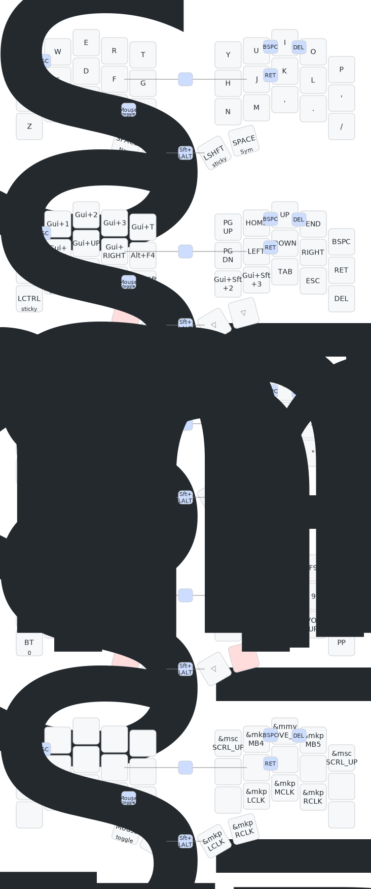

# zmk-sweep-ru

Ferris Sweep ZMK keymap · Linux · English + Russian · Mouse-free

[](https://github.com/MisterJeffryEpstein/zmk-sweep-ru/actions/workflows/build.yml)
[](https://github.com/MisterJeffryEpstein/zmk-sweep-ru/actions/workflows/draw.yml)

---

## Keymap



*Auto-generated by [keymap-drawer](https://github.com/caksoylar/keymap-drawer) on every push*

---

**Setup in GNOME:**
Settings → Keyboard → Input Sources → add Russian →
set the switch shortcut to `Shift+Alt`

---

## Layers

| # | Name | How to reach |
|---|------|--------------|
| 0 | Base | always on |
| 1 | Nav | hold left thumb |
| 2 | Sym | hold right thumb |
| 3 | Num | hold both thumbs (Nav+Sym) |
| 4 | Fun | Nav layer → right thumb |
| 5 | Mouse | combo V+B to toggle |

### Nav layer — left hand controls desktop, right hand navigates

```
Left hand:                        Right hand:
Search  WS1  WS2  WS3  Terminal   PgUp  Home  ↑     End    Bspc
Lock    ←■   □▲   ■→   Close      PgDn  ←     ↓     →      Enter
Ctrl    Alt  Shft Gui  MvWS1      MvWS2 MvWS3 Tab   Esc    Del
```

WS = workspace, Mv = move window to workspace, ■ = snap/maximize

---

## Combos

| Keys | Result |
|------|--------|
| Q + W | Escape |
| A + S | Tab |
| J + K | Enter |
| U + I | Backspace |
| I + O | Delete |
| F + J | Caps Word |
| V + B | Toggle Mouse layer |
| Inner thumbs | Switch EN ↔ RU |

---

## Hardware

- Ferris Sweep v2.2
- nice!nano v2 controllers
- Kailh Choc v1 switches
- ZMK firmware

---

## How to flash

1. Go to **Actions** → latest successful build → **Artifacts** → download zip
2. Unzip — you get two files:
   - `cradio_left-nice_nano_v2-zmk.uf2`
   - `cradio_right-nice_nano_v2-zmk.uf2`
3. Plug in **left half** via USB
4. Double-press the Reset button → controller shows up as `NICENANO` USB drive
5. Drag `cradio_left-...uf2` onto the drive — it disconnects automatically
6. Repeat for right half with the right `.uf2`
7. Unplug USB, connect both halves with TRRS cable, done

---

## Based on

[duckyb/zmk-sweep](https://github.com/duckyb/zmk-sweep) — adapted for Linux · EN + RU
